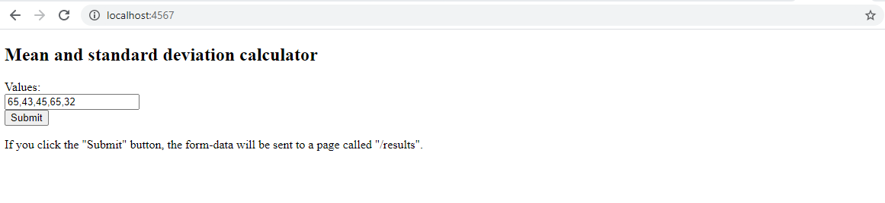
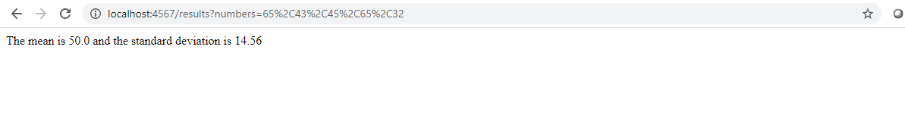
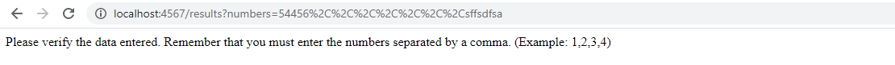
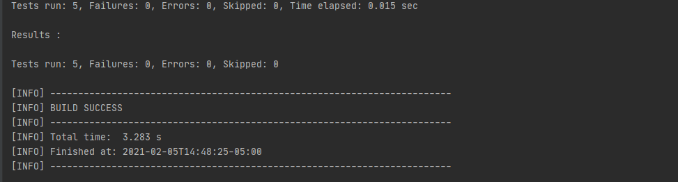
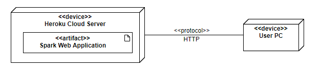
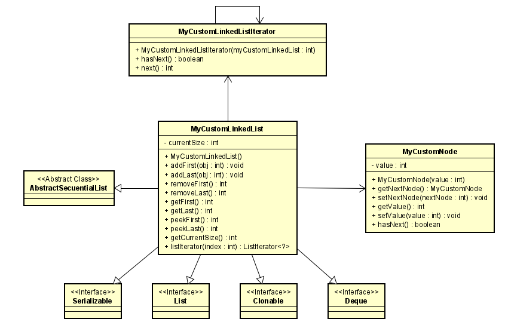
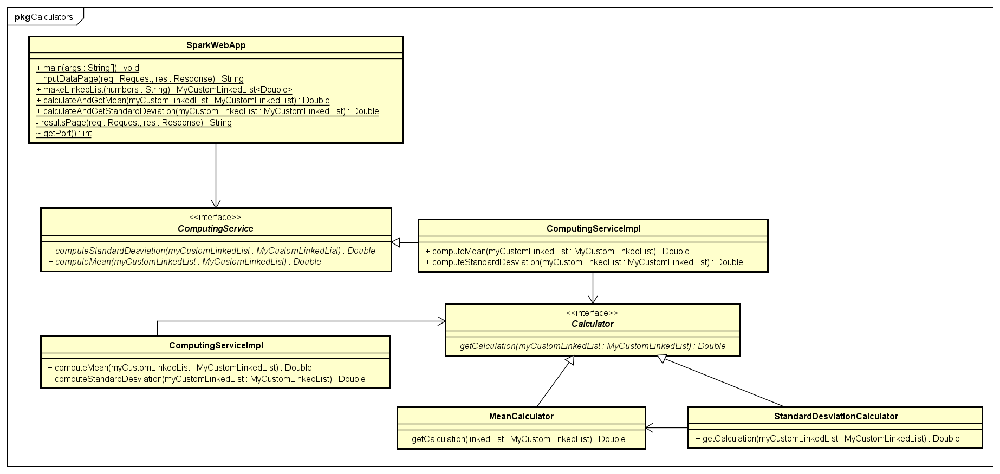

# AREP-LAB2
## Calculator of standard deviation and mean of a set of n numbers.

Spark Web Application that calculates the mean and standard deviation of a set of n real numbers.
The program reads the n real numbers from a web page.

[](https://murmuring-wildwood-50150.herokuapp.com/)

[](https://app.circleci.com/pipelines/github/NicolasAguilera9906/AREP-LAB2)

## Getting Started

The following instructions will allow you to have a copy of the project and run it on your machine.

### Prerequisites

* [Maven](https://maven.apache.org/) - Dependency Management
* [Java 8](https://www.oracle.com/co/java/technologies/javase/javase-jdk8-downloads.html) -  Development Environment 
* [Git](https://git-scm.com/) - Version Control System
* [Spark](http://sparkjava.com/) - Micro framework for creating web applications in Java 8

### Installing

1. Clone the repository

```
git clone https://github.com/NicolasAguilera9906/AREP-LAB2
```

2. Compile the projet

```
mvn package
```

3. Executing the program

```
mvn exec:java -D "exec.mainClass"="edu.escuelaing.arem.designprimer.SparkWebApp"

In your browser: http://localhost:4567
```
To use the application you must enter the numbers separated by commas. Then you must press the submit button



Then you will be redirected to / results where you can see the result of the mean and the standard deviation of the entered numbers.



In case of getting an error when entering the numbers you will get the following message



4. Generating the documentation

```
mvn javadoc:javadoc
```

The documentation will be generated in target/site/apidocs/index.html.

## Documentation

View [Documentation](https://nicolasaguilera9906.github.io/AREP-LAB2/)

## Running the tests

To run the unit tests

```
mvn test
```


## Diagrams

### Deploy diagram

The client will access from his machine through the HTTP protocol the heroku cloud server that stores a spark web application. This microframework will allow us to create java web applications. In addition, it is very simple and lightweight and will manage all the requests made by the user to, in this case, calculate the mean and standard deviation of a set of numbers.



### Own LinkedList

An own implementation of LinkedList is made. The class extends AbstractSecuentialList and implements the List, Deque, Clonable and Serializable interfaces to be compatible with the Java api. It also makes its own implementation of the Linked List Iterator, extending from Iterator. Finally, it has its own implementation of the nodes that are part of the LinkeList, each of them stores the value and the reference to the next node.



### SparkWebApp

There is a class called ComputingService that will allow the user to access the application services. In this case, this class will connect with an interface called Calculator that will allow to perform an operation on a LinkedList. In this case, the standard deviation or the mean of the values in the LinkedList can be calculated. For that there are two classes called MeanCalculator and StandardDesviationCalculator that extend from the Calculator interface. This allows us to add more operations easily in case the user requires it.

The services mentioned above are accessed from the SparkWebApp class, which is in charge of reading the request made with the client, calculating the mean and standard deviation with the numbers read and finally returning the response to the client in html format.



## Built With

* [Maven](https://maven.apache.org/) - Dependency Management
* [Spark](http://sparkjava.com/) - Micro framework for creating web applications in Java 8
* [Heroku](https://www.heroku.com/platform) - Deploy platform

## Inform

[View inform](https://github.com/NicolasAguilera9906/AREP-LAB2/blob/main/resources/inform.pdf)

## Author

* **Nicolás Aguilera Contreras** 

## License

This project is under GNU General Public License - see the [LICENSE](LICENSE) file for details.
