# AREP-LAB3
## Nicolás Aguilera Contreras

[](https://infinite-ridge-77551.herokuapp.com/index.html)

[](https://app.circleci.com/pipelines/github/NicolasAguilera9906/AREP-LAB3)

## Deliverables

### Challenge 1

This challenge consists of developing a web server that supports multiple requests in a row (not concurrent). The server should return all requested files, including html pages and images. A website is built with javascript to test the server. The solution is deployed on Heroku. 

### Challenge 2 

Using the preview server and java. This challenge consists on writing a Spark-like framework that allows you to publish "get" web services with lambda functions and allows you to access static resources such as pages, javascripts, images, and CSSs. In adittion , it includes an application that connects to a database from the server to test the solution. The solution is deployed on Heroku

## Getting Started

The following instructions will allow you to have a copy of the project and run it on your machine.

### Prerequisites

* [Maven](https://maven.apache.org/) - Dependency Management
* [Java 8](https://www.oracle.com/co/java/technologies/javase/javase-jdk8-downloads.html) -  Development Environment 
* [Git](https://git-scm.com/) - Version Control System

### Installing

1. Clone the repository

```
https://github.com/NicolasAguilera9906/AREP-LAB3/
```

2. Compile the projet

```
mvn package
```

3. Executing the program

```
mvn exec:java -D "exec.mainClass"="edu.escuelaing.demo.NanoSparkWebDemo" 

In your browser: 
For Challenge 1 : http://localhost:35000/index.html
For Challenge 2 : http://localhost:35000/Apps/hello?value=name. Replace name with your name 

```

4. Generating the documentation

```
mvn javadoc:javadoc
```


## Documentation

View [Documentation](https://nicolasaguilera9906.github.io/AREP-LAB3/)

## Use

### Challenge 1

To use Challenge 1 you must enter the following link in your browser

If you use it locally : http://localhost:35000/index.html

If you use it on Heroku : https://infinite-ridge-77551.herokuapp.com/index.html

You will get access to the following page

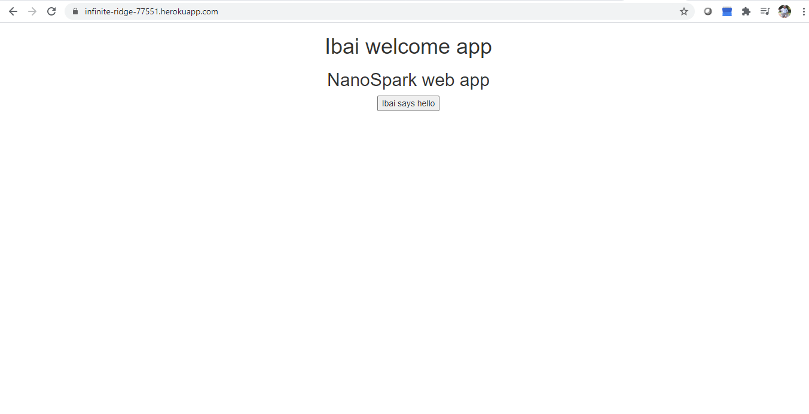

By clicking on the button you can load a static resource, in this case an image

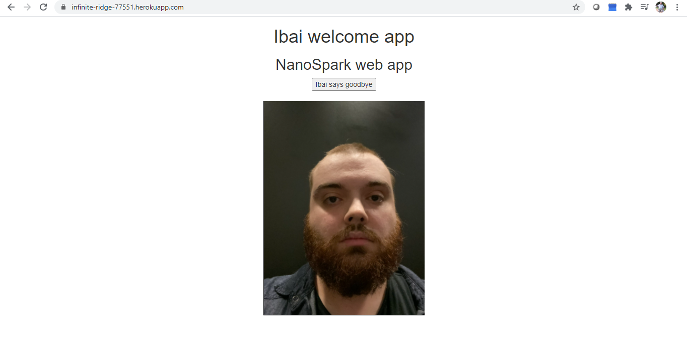

You can also access that image from the url putting /ibai.png at the end of the url

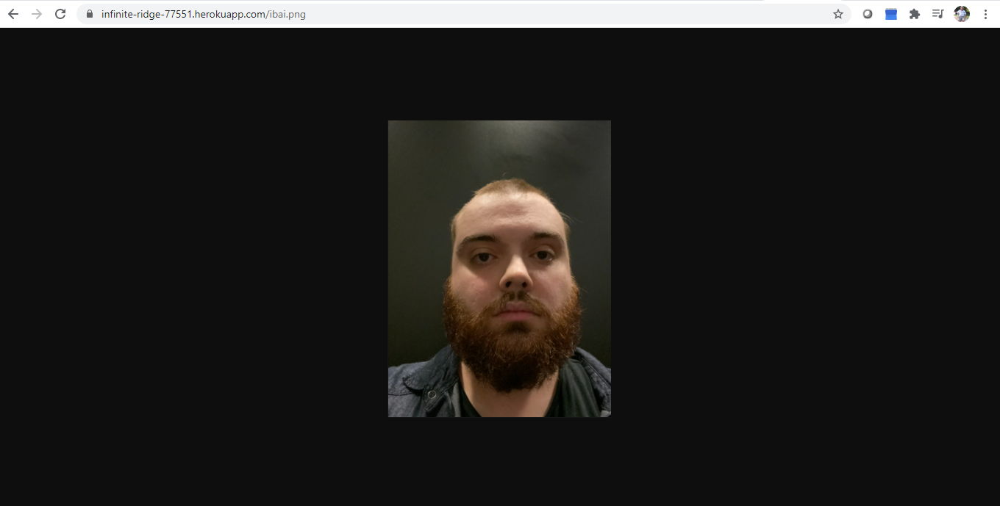

You can also access the javascript on which the page is loaded from the url putting /webapp.js at the end of the url

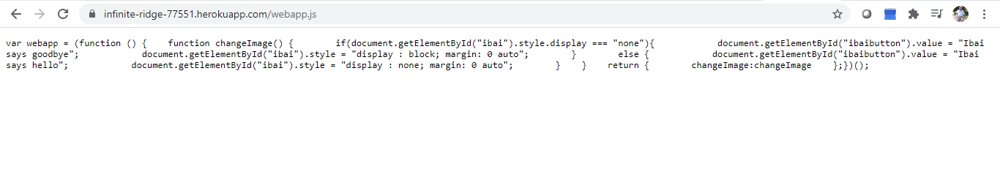

## Challenge 2

To use Challenge 1 you must enter the following link in your browser

If you use it locally : http://localhost:35000/Apps/hello?value=name

If you use it on Heroku : https://infinite-ridge-77551.herokuapp.com/Apps/hello?value?name

You can replace name with whatever value you want, either with your name or names separated with commas

You will get access to the following page where you will get a greeting with the names you entered.

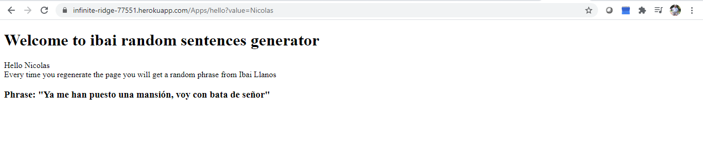

Every time you reload the page you will get a random phrase from the famous Spanish streamer Ibai Llanos.

These messages are loaded from a Firebase database

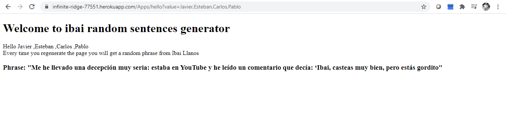

In the case of not entering any name you will get the following message

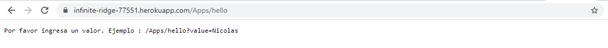

## Diagrams

### Class Diagram

The program uses the HttpServer class to create a web server. Clients will connect to it via sockets.

The NanoSparkWebDemo class will have the Main method of the application. From there it will call the NanoSpark class which will take care of initializing the NanoSparkWebServer class.

The NanoSparkWebServer class will take care of starting the http server. Additionally, it will register the endpoints that the web server saves through a map that contains two parameters: the key corresponding to the path requested by a user and a binary function with two parameters (request and response) that results in a String containing the result of the user action, this last parameter is a functional interface and represents a lambda function.

Finally we have the DataBaseConnector class that will be in charge of connecting to an external Firebase database to develop one of the application's functionalities

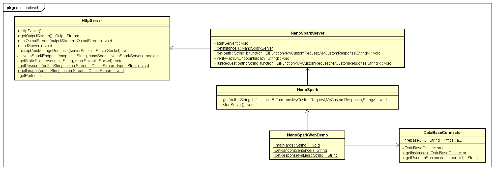

### Components Diagram

We have three main components: FrontEnd, BackEnd, and FirebaseDB.

The FrontEnd component will store the static files of our application.

The Backend component  will be in charge of managing the logic of our web server as well as our connection to the database.

Finally in FirebaseDB component we will store the data of our database

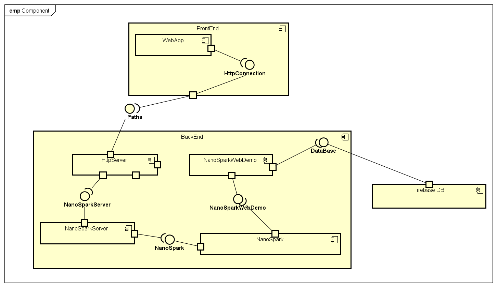

### Deploy Diagram

Our application will be stored on the heroku cloud server. The client will connect to it through the HTTP protocol. On the other hand, our application will connect to the database through the HTTPS protocol

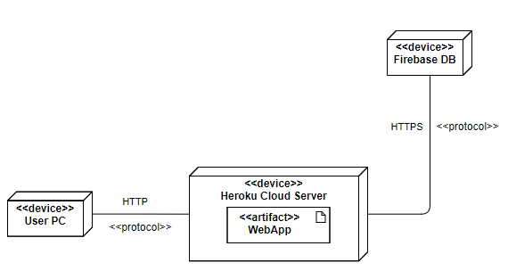

## Tests 

3 tests were made proving that the application will correctly find the static resources

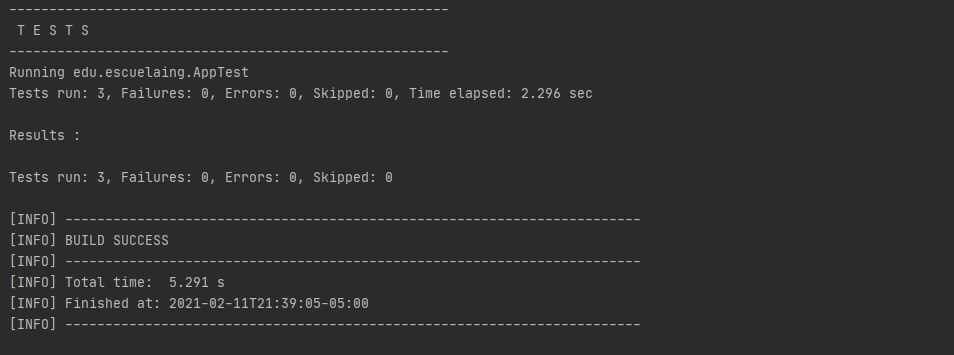


## Built With

* [Maven](https://maven.apache.org/) - Dependency Management
* [Heroku](https://www.heroku.com/platform) - Deploy platform
* [Firebase Realtime Database](https://firebase.google.com/products/realtime-database?hl=es) - Cloud-hosted NoSQL database

## Inform

* [View inform]()

## Author

* **Nicolás Aguilera Contreras** 


## License

This project is under GNU General Public License - see the [LICENSE](LICENSE) file for details.

