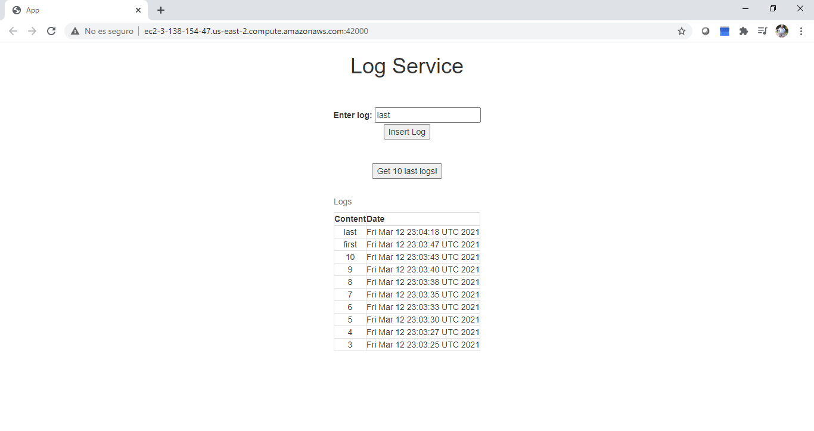

# AREP-LAB 5

## AWS WORKSHOP

In this workshop a system capable of publishing messages will be built. This system is composed of a load balancer component, 3 web logic components and a MongoDB database component, each of which is modularized into Docker containers.


### Prerequisites

* [Docker](https://www.docker.com/) - Container Manager
* [Maven](https://maven.apache.org/) - Dependency Management
* [Java 8](https://www.oracle.com/co/java/technologies/javase/javase-jdk8-downloads.html) -  Development Environment 
* [Git](https://git-scm.com/) - Version Control System
* [Spark](http://sparkjava.com/) - Micro framework for creating web applications in Java 8


## Instrucciones de uso 

1. Clone the repository

```
git clone https://github.com/NicolasAguilera9906/AREP-LAB5
```

2. Compile the projet

```
mvn package 
```

3. Executing the program (you must use the command from the root directory using Docker ToolBox)

```
docker-compose up -d 
```

The application can be used from http://ec2-3-138-154-47.us-east-2.compute.amazonaws.com:42000/


## Test

Posting logs.


Last 10 logs printed with date.




## Built With

* [Maven](https://maven.apache.org/) - Dependency Management
* [Spark](http://sparkjava.com/) - Micro framework for creating web applications in Java 8

## Documentation

View Round Robin app [Documentation](https://nicolasaguilera9906.github.io/AREP-LAB5/apidocs_rr/)

View Log Service app [Documentation](https://nicolasaguilera9906.github.io/AREP-LAB5/apidocs_ls/)

## Inform

The architecture document can be found [here](inform.pdf)


## Author

* **Nicolás Aguilera Contreras** 


## License

This project is under GNU General Public License - see the [LICENSE](LICENSE) file for details.
