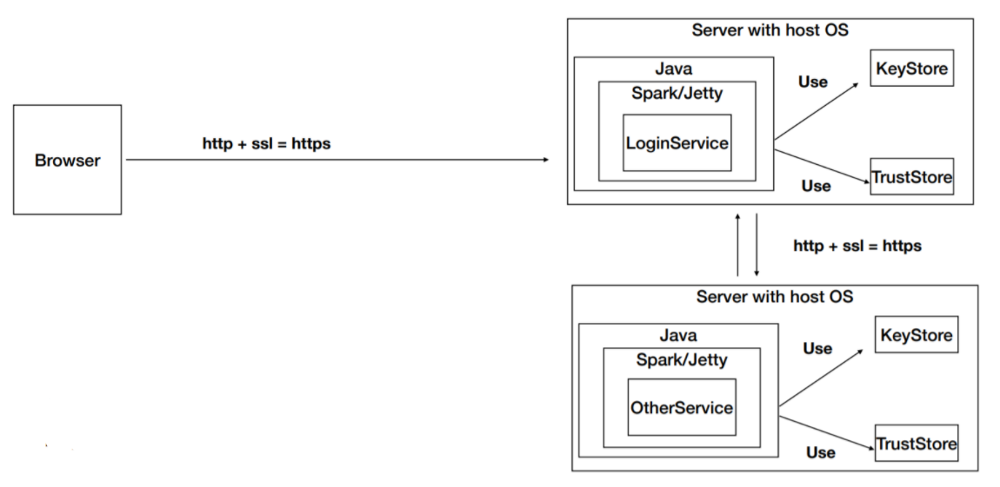

# Spark Secure

In this workshop a secure Web application will be developed with the following requirements:

It must allow secure access from the browser to the application. In other words, it must guarantee user authentication, authorization and integrity.

It must have at least two computers communicating with each other and remote services access must guarantee: authentication, authorization and integrity between the services. No one can invoke the services if they are not authorized.


## Getting Started

The following instructions will allow you to have a copy of the project and run it on your machine.

### Prerequisites

* [Maven](https://maven.apache.org/) - Dependency Management
* [Java 8](https://www.oracle.com/co/java/technologies/javase/javase-jdk8-downloads.html) -  Development Environment 
* [Git](https://git-scm.com/) - Version Control System
* [Spark](http://sparkjava.com/) - Micro framework for creating web applications in Java 8

### Installing

1. Clone the repository

```
git clone https://github.com/NicolasAguilera9906/AREP-LAB6
```

2. Compile the two projets

```
mvn package
```

3. Executing the login program

```
In Login directory

mvn exec:java -D "exec.mainClass"="edu.escuelaing.arep.SparkWebApp"

In your browser: https://localhost:5000

Email: test@mail.com
Password: test123
```

4. Executing the service program

```
In Service directory

mvn exec:java -D "exec.mainClass"="edu.escuelaing.arep.SparkWebApp"

```


5. Generating the documentation

```
mvn javadoc:javadoc
```

The documentation will be generated in target/site/apidocs/index.html.

## Documentation

View [Documentation Login]()

View [Documentation Service]()

## Arquitectura




## Built With

* [Maven](https://maven.apache.org/) - Dependency Management
* [Spark](http://sparkjava.com/) - Micro framework for creating web applications in Java 8


## Author

* **Nicolás Aguilera Contreras** 


## License

This project is under GNU General Public License - see the [LICENSE](LICENSE) file for details.
