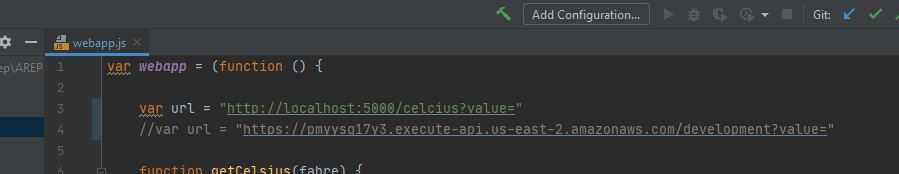
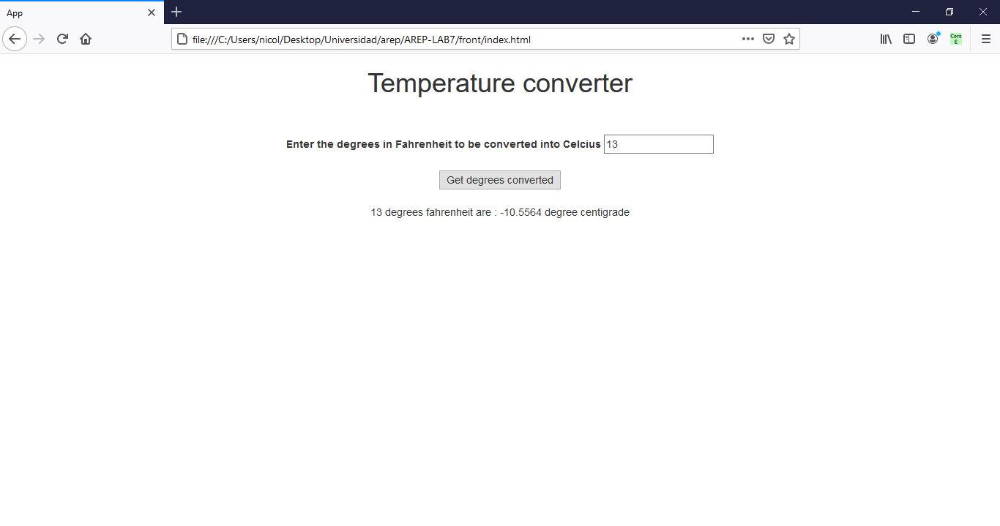
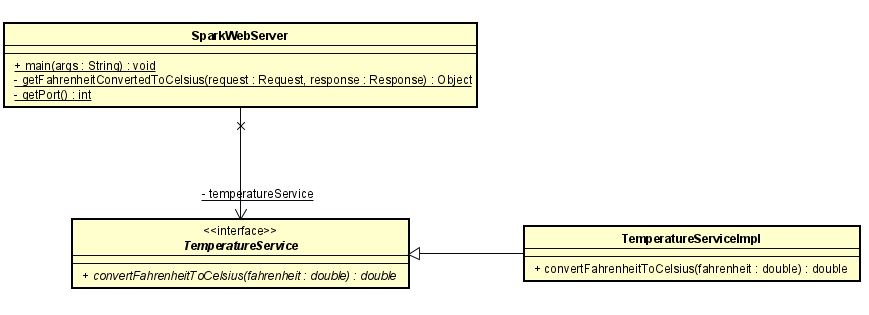
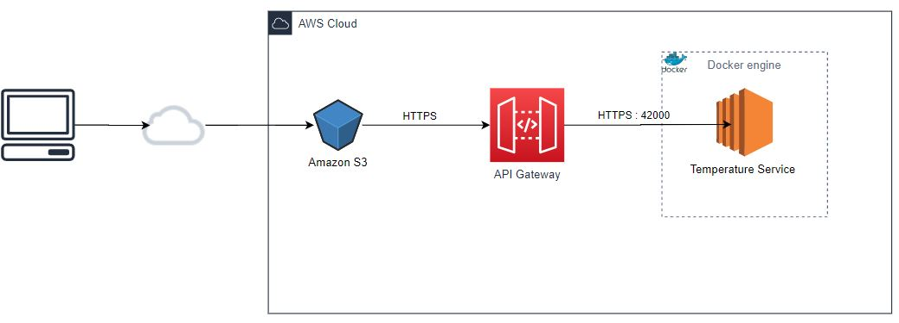
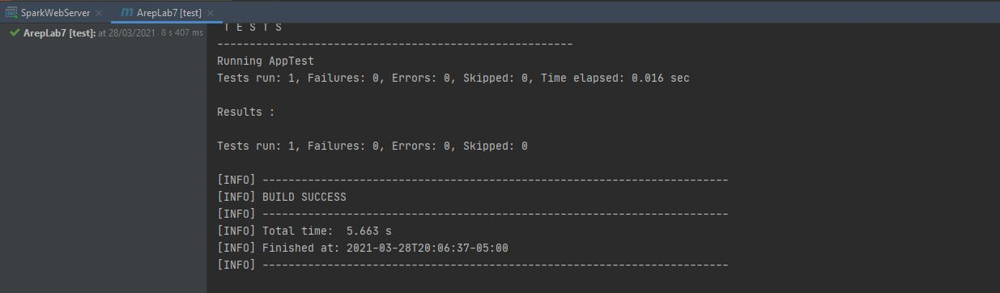

# Amazon Gateway and Lambda Workshop

The workshop will develop : 

  1. A Web service in Spark that converts from degrees farenheit to degrees celcius. The service responds a JSON.
  2. The service deployed on an AWS EC2 machine and published on it.
  3. A route in the getway API to access the service. The integration is not with lambda function.
  4. A JS application to use the service. The application deployed in S3. It is available over the internet.
  5. Tests for the Web Application
  6. The developed code on Github, a test report, and a video with the experiment running.

### Prerequisites

* [Maven](https://maven.apache.org/) - Dependency Management
* [Java 8](https://www.oracle.com/co/java/technologies/javase/javase-jdk8-downloads.html) -  Development Environment 
* [Git](https://git-scm.com/) - Version Control System
* [Spark](http://sparkjava.com/) - Micro framework for creating web applications in Java 8

## Getting Started

The following instructions will allow you to have a copy of the project and run it on your machine.

### Prerequisites

* [Maven](https://maven.apache.org/) - Dependency Management
* [Java 8](https://www.oracle.com/co/java/technologies/javase/javase-jdk8-downloads.html) -  Development Environment 
* [Git](https://git-scm.com/) - Version Control System
* [Spark](http://sparkjava.com/) - Micro framework for creating web applications in Java 8

## Installing

### Back-End

1. Clone the repository

```
git clone https://github.com/NicolasAguilera9906/AREP-LAB6
```

2. Go to the ```/back``` directory

3. Compile the project

```
mvn package
```

4. Executing the program

```
mvn exec:java -D "exec.mainClass"="co.escuelaing.edu.SparkWebAppServer"

In your browser: https://localhost:5000/celcius?value=<VALUE>
```

5. Generating the documentation

```
mvn javadoc:javadoc
```

### Front-End

1. First follow the steps to run the Back-End

2. Go to the ```/front``` directory

3. Change the ```/url``` variable in the ```js/webapp.js``` file to ```http://localhost:5000/celcius?value=```



3. Go to firefox and install [CORS EVERYWHERE](https://addons.mozilla.org/es/firefox/addon/cors-everywhere/#:~:text=The%20button%20can%20be%20found,enabled%2C%20CORS%20rules%20are%20bypassed)

4. Open the ```index.html``` file in your firefox browser

5. You will see the following page and you can convert the degrees



## Documentation

View [Documentation](https://nicolasaguilera9906.github.io/AREP-LAB7/)

## Architecture

### Class diagram

The SparkWebServer class is in charge of generating a Spark server with 2 endpoints:

/hello for a welcome message
/celcius for converting degrees Fahrenheit to degrees Celsius.

This class makes use of the TemperatureService class, which is an interface that will provide the temperature services. This class is implemented by the TemperatureServiceImpl class with a specific implementation of the temperature services. In this way, it will be easier for the user to make use of another implementation of these services.



### Deployment diagram

The client accesses a JS application deployed on Amazon S3. This application connects to a route implemented in API Gateway that accesses the service located in AWS EC2. This service is contained in a docker microcontainer and is responsible for performing the temperature calculation.



## Tests

### Demonstration videos

#### Application running on AWS EC2

[View video](https://www.youtube.com/watch?v=TSVzcVlf-To)

#### Application running on API Gateway

[View video](https://www.youtube.com/watch?v=YJnfLfLFuI0)

#### Accessing the application from Amazon S3

[View video](https://www.youtube.com/watch?v=yeHtSDbs7wM)

#### JUnit tests

A test was made to verify that the application correctly converts the degrees



## Built With

* [Maven](https://maven.apache.org/) - Dependency Management
* [Spark](http://sparkjava.com/) - Micro framework for creating web applications in Java 8

## Author

* **Nicolás Aguilera Contreras** 

## License

This project is under GNU General Public License - see the [LICENSE](LICENSE) file for details.

