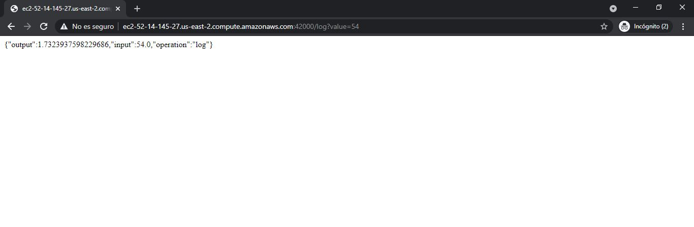
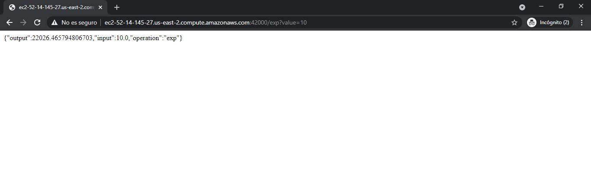
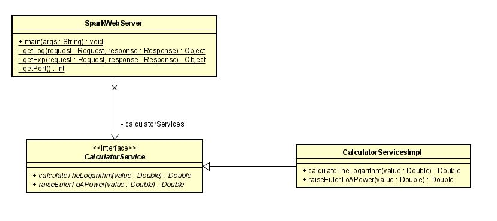
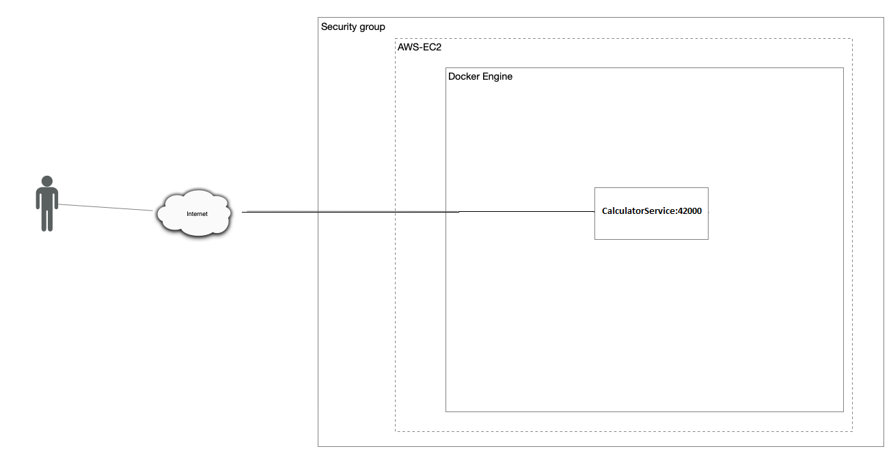
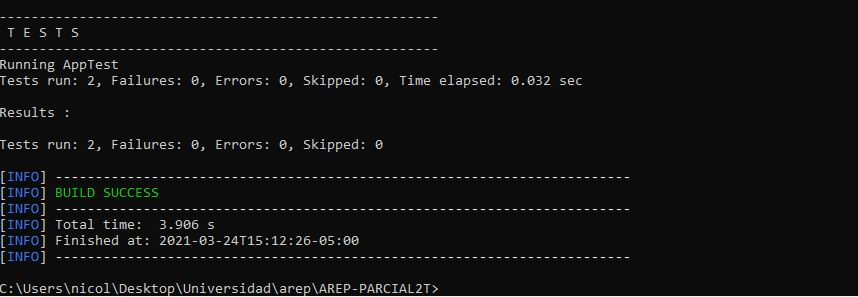

# AREP-PARCIAL 2T
## Nicolás Aguilera Contreras


## Entregable

Microcontenedor docker desplegado en una instancia  EC2 de AWS. Todas las funciones reciben un solo parámetro de tipo "Double" y retornan una prámetro sde tipo "Double".

Las funciones realizadas fueron :

  - Log : logaritmo
  - Exp : el número de eauler elevado a la potendia del parámetro

## Comenzando

Las siguientes instrucciones le permitirán tener una copia del proyecto y ejecutarlo en su máquina.

### Prerrequisitos

* [Maven](https://maven.apache.org/) - Dependency Management
* [Java 8](https://www.oracle.com/co/java/technologies/javase/javase-jdk8-downloads.html) -  Development Environment 
* [Git](https://git-scm.com/) - Version Control System

### Instalación

1. Clone el repositorio

```
https://github.com/NicolasAguilera9906/AREP-PARCIAL2T
```

2. Compile el proyecto

```
mvn package
```

3. Ejectute el programa

```
mvn exec:java -D "exec.mainClass"="co.escuelaing.edu.SparkWebServer" 

En su navegador: 
Para log service : http://localhost:5000/log?value=<value>
Para exp service : http://localhost:5000/exp?value=<value>

```

4. Generar documentación

```
mvn javadoc:javadoc
```

## Instalación en instancia de EC2 de AWS.

1. Acceda a su máquina virtual de AWS
2. Instale Docker

```
sudo yum update -y
sudo yum install docker
```

3. Inicie el servicio de docker
```
sudo service docker start
```

4. Configure su usuario en el grupo de docker para no tener que ingresar “sudo” cada vez que invoca un comando
```
sudo usermod -a -G docker ec2-user
```

5. Desconectese de la máquina virtual e ingrese nuevamente para que la configuración de grupos de usuarios tenga efecto.

6. A partir de la imagen creada en Dockerhub cree una instancia de un contenedor docker independiente de la consola (opción “-d”) y con el puerto 6000 enlazado a un puerto físico de su máquina (opción -p):

```
docker run -d -p 42000:6000 --name arepparcial2t nicolasaguilera9906/arepparcial2t
```

7. Abra los puertos de entrada del security group de la máxima virtual para acceder al servicio

9. Verifique que pueda acceder en una url similar a esta (la url específica depende de los valores de su maquina virtual EC2)

```
http://ec2-52-14-145-27.us-east-2.compute.amazonaws.com:42000/exp?value=18
http://ec2-52-14-145-27.us-east-2.compute.amazonaws.com:42000/log?value=18
http://ec2-52-14-145-27.us-east-2.compute.amazonaws.com:42000/hello
```


## Documentación

Ver [Documentación](https://nicolasaguilera9906.github.io/AREP-PARCIAL2T/)

## Uso

### Para el log service

Ingresa en el parametro del valor en la URL el número sobre el que quiera que se calcule el logaritmo.

- El puerto será 5000 si corre el programa localmente. Si lo corre desde AWS dependerá del comando que haya utilizado para correrlo. En la parte superior del README se utilizó el puerto 42000.

```
http://<URL>:port/log?value=<value>
```
Obtendrá un numero que será el resultado de calcular el logaritmo a el valor ingresado como parametro



### Para el exp service

Ingresa en el parametro del valor en la URL el número sobre el que se elevará el numero de Euler.

- El puerto será 5000 si corre el programa localmente. Si lo corre desde AWS dependerá del comando que haya utilizado para correrlo. En la parte superior del README se utilizó el puerto 42000.

```
http://<URL>:port/log?value=<value>
```
Obtendrá un numero que será el resultado de elevar el numero de Euler a el valor ingresado como parametro




## Diagramas

### Diagrama de clases

La clase SparkWebServer se encarga de generar un servidor Spark con 3 endpoints:

- /hello para un mensaje de bienvenida
- /log para calcular el logaritmo de un numero
- /exp para elevar el numero de Euler a un numero en específico

Esta clase hace uso de la clase CalculatorServices , que es una interfaz que proveerá los servicios de la calculadora. A esta clase la implementa la clase CalculatorServicesImpl con una implementación en específico de los servicios de la calculadora. De esta manera , será más fácil para el usuario si desea hacer uso de otra implementación de estos servicios.



### Diagrama de despliegue

CalculatorService es un servicio REST con dos endpoints GET : 

- /log para calcular el logaritmo de un numero
- /exp para elevar el numero de Euler a un numero en específico

Este servicio se encuentra desplegado en AWS usando una instancia de EC2 dentro un microcontenedor Docker.



### Video demostrativo 

Link del video : https://www.youtube.com/watch?v=dHOHl47b5t0

## Pruebas 

2 pruebas fueron hechas para demostrar que la aplicación calcule correctamente el logaritmo de un número y eleve correctamente el numero de Euler a otro valor.



## Autor

* **Nicolás Aguilera Contreras** 


## Licencia

Este proyecto está bajo la licencia GNU General Public License - ver el archivo [LICENSE](LICENSE) para detalles.

